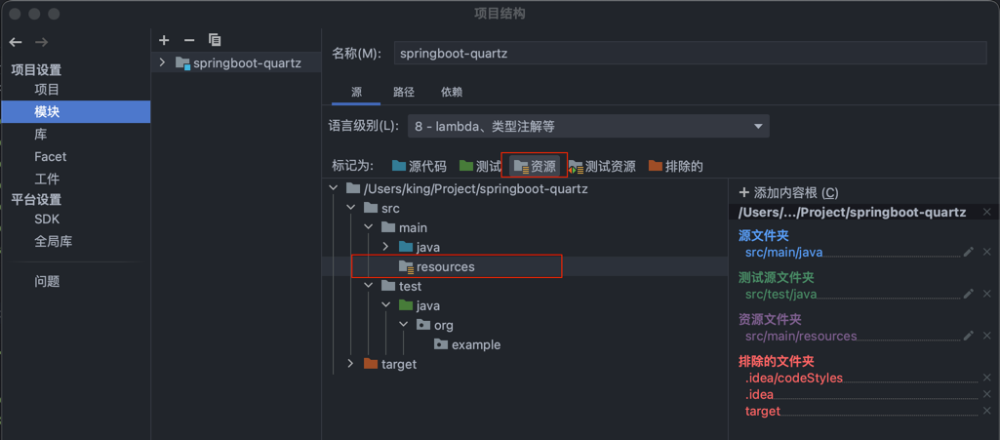

# springboot-quartz
拿来即用的企业级springboot整合quartz定时任务框架

> 本项目是二次开发（原作者找不到了，在此表示感谢），最近在做架构升级初次接触到quartz这个定时任务框架，想要实现的效果就是springboot整合quartz实现定时的统一管理。
> 在网上找了很多资料和项目，他们道理讲的很明白，但是给的例子只是简单的demo，用来自己学习玩玩还行，无法应用到实际的生产项目中。
> 于是经过我的一番摸索，把看到的项目整合在一起，做一个`拿来即用的企业级springboot整合quartz定时任务框架`。

## 使用方法
1、下载本项目到本地
```
https://github.com/fmz200/springboot-quartz.git
```

2、在数据库中执行resources目录下的`tables_mysql.sql`文件把需要的表都创建好，修改`quartz_data.properties`和`application.properties`配置文件中的数据库用户名和密码。

3、启动项目，就可以看到定时任务已经在执行了，你不要其他的操作。

4、新增一个定时任务也很简单，只需要做两件事：
> 1、在`org/example/job`目录新建一个定时任务（其实在哪都行），只需要继承`job`类；
> 
> 2、在resources目录下的`quartz_data.xml`文件内配置新增的定时任务；
> 
> 3、重启项目，查看新增的定时任务是否成功执行。

### 常见错误
1、这个错误是因为这个调度器已经被注册过了。
注册的时点和位置是 创建监听器 executorListener 时，会调用quartz.properties文件注册一个scheduler。注册的位置是 QuartzInitializerListener 的 contextInitialized 方法。
因此，自定义的quartz配置文件名称不可以叫quartz.properties，org.quartz.scheduler.instanceName的值也不能为DefaultQuartzScheduler。
修改好以上两处，问题即可解决。
```
Caused by: java.lang.IllegalStateException: Active Scheduler of name 'MyScheduler' already registered in Quartz SchedulerRepository. Cannot create a new Spring-managed Scheduler of the same name!
	at org.springframework.scheduling.quartz.SchedulerFactoryBean.createScheduler(SchedulerFactoryBean.java:679)
	at org.springframework.scheduling.quartz.SchedulerFactoryBean.prepareScheduler(SchedulerFactoryBean.java:614)
	at org.springframework.scheduling.quartz.SchedulerFactoryBean.afterPropertiesSet(SchedulerFactoryBean.java:502)
	at org.springframework.beans.factory.support.AbstractAutowireCapableBeanFactory.invokeInitMethods(AbstractAutowireCapableBeanFactory.java:1862)
	at org.springframework.beans.factory.support.AbstractAutowireCapableBeanFactory.initializeBean(AbstractAutowireCapableBeanFactory.java:1799)
	... 58 common frames omitted

```

2、以下错误全部都是pom文件中的依赖包版本过低或者缺少依赖包，并不是代码问题。
```
2023-02-25 21:48:35.785 ERROR 30399 --- [eate-1264090800] com.alibaba.druid.pool.DruidDataSource   : create connection SQLException, url: jdbc:mysql://127.0.0.1:3306/test_quartz?characterEncoding=utf8&useSSL=false&autoReconnect=true&serverTimezone=UTC, errorCode 0, state 08001

com.mysql.jdbc.exceptions.jdbc4.MySQLNonTransientConnectionException: Could not create connection to database server. Attempted reconnect 3 times. Giving up.
	at sun.reflect.NativeConstructorAccessorImpl.newInstance0(Native Method) ~[na:1.8.0_231]
	at sun.reflect.NativeConstructorAccessorImpl.newInstance(NativeConstructorAccessorImpl.java:62) ~[na:1.8.0_231]
	at sun.reflect.DelegatingConstructorAccessorImpl.newInstance(DelegatingConstructorAccessorImpl.java:45) ~[na:1.8.0_231]
	at java.lang.reflect.Constructor.newInstance(Constructor.java:423) ~[na:1.8.0_231]
	at com.mysql.jdbc.Util.handleNewInstance(Util.java:404) ~[mysql-connector-java-5.1.38.jar:5.1.38]
	at com.mysql.jdbc.Util.getInstance(Util.java:387) ~[mysql-connector-java-5.1.38.jar:5.1.38]
	at com.mysql.jdbc.SQLError.createSQLException(SQLError.java:917) ~[mysql-connector-java-5.1.38.jar:5.1.38]
	at com.mysql.jdbc.SQLError.createSQLException(SQLError.java:896) ~[mysql-connector-java-5.1.38.jar:5.1.38]
	at com.mysql.jdbc.SQLError.createSQLException(SQLError.java:885) ~[mysql-connector-java-5.1.38.jar:5.1.38]
	at com.mysql.jdbc.SQLError.createSQLException(SQLError.java:860) ~[mysql-connector-java-5.1.38.jar:5.1.38]
	at com.mysql.jdbc.ConnectionImpl.connectWithRetries(ConnectionImpl.java:2165) ~[mysql-connector-java-5.1.38.jar:5.1.38]
	at com.mysql.jdbc.ConnectionImpl.createNewIO(ConnectionImpl.java:2090) ~[mysql-connector-java-5.1.38.jar:5.1.38]
	at com.mysql.jdbc.ConnectionImpl.<init>(ConnectionImpl.java:795) ~[mysql-connector-java-5.1.38.jar:5.1.38]
	at com.mysql.jdbc.JDBC4Connection.<init>(JDBC4Connection.java:44) ~[mysql-connector-java-5.1.38.jar:5.1.38]
	at sun.reflect.NativeConstructorAccessorImpl.newInstance0(Native Method) ~[na:1.8.0_231]
	at sun.reflect.NativeConstructorAccessorImpl.newInstance(NativeConstructorAccessorImpl.java:62) ~[na:1.8.0_231]
	at sun.reflect.DelegatingConstructorAccessorImpl.newInstance(DelegatingConstructorAccessorImpl.java:45) ~[na:1.8.0_231]
	at java.lang.reflect.Constructor.newInstance(Constructor.java:423) ~[na:1.8.0_231]
	at com.mysql.jdbc.Util.handleNewInstance(Util.java:404) ~[mysql-connector-java-5.1.38.jar:5.1.38]
	at com.mysql.jdbc.ConnectionImpl.getInstance(ConnectionImpl.java:400) ~[mysql-connector-java-5.1.38.jar:5.1.38]
	at com.mysql.jdbc.NonRegisteringDriver.connect(NonRegisteringDriver.java:327) ~[mysql-connector-java-5.1.38.jar:5.1.38]
	at com.alibaba.druid.pool.DruidAbstractDataSource.createPhysicalConnection(DruidAbstractDataSource.java:1570) ~[druid-1.1.12.jar:1.1.12]
	at com.alibaba.druid.pool.DruidAbstractDataSource.createPhysicalConnection(DruidAbstractDataSource.java:1636) ~[druid-1.1.12.jar:1.1.12]
	at com.alibaba.druid.pool.DruidDataSource$CreateConnectionThread.run(DruidDataSource.java:2505) ~[druid-1.1.12.jar:1.1.12]
Caused by: java.lang.NullPointerException: null
	at com.mysql.jdbc.ConnectionImpl.getServerCharset(ConnectionImpl.java:3005) ~[mysql-connector-java-5.1.38.jar:5.1.38]
	at com.mysql.jdbc.MysqlIO.sendConnectionAttributes(MysqlIO.java:1916) ~[mysql-connector-java-5.1.38.jar:5.1.38]
	at com.mysql.jdbc.MysqlIO.proceedHandshakeWithPluggableAuthentication(MysqlIO.java:1845) ~[mysql-connector-java-5.1.38.jar:5.1.38]
	at com.mysql.jdbc.MysqlIO.doHandshake(MysqlIO.java:1215) ~[mysql-connector-java-5.1.38.jar:5.1.38]
	at com.mysql.jdbc.ConnectionImpl.coreConnect(ConnectionImpl.java:2255) ~[mysql-connector-java-5.1.38.jar:5.1.38]
	at com.mysql.jdbc.ConnectionImpl.connectWithRetries(ConnectionImpl.java:2106) ~[mysql-connector-java-5.1.38.jar:5.1.38]
	... 13 common frames omitted
```

3、下面的这个错误如果你实在找不到原因，就看看resources目录是否被标记为`资源`（我是因为没有标记报错）。

```
2023-02-25 21:54:44.798  INFO 30571 --- [           main] ConditionEvaluationReportLoggingListener : 

Error starting ApplicationContext. To display the conditions report re-run your application with 'debug' enabled.
2023-02-25 21:54:44.804 ERROR 30571 --- [           main] o.s.b.d.LoggingFailureAnalysisReporter   : 

***************************
APPLICATION FAILED TO START
***************************

Description:

Failed to configure a DataSource: 'url' attribute is not specified and no embedded datasource could be configured.

Reason: Failed to determine a suitable driver class


Action:

Consider the following:
	If you want an embedded database (H2, HSQL or Derby), please put it on the classpath.
	If you have database settings to be loaded from a particular profile you may need to activate it (no profiles are currently active).

```

